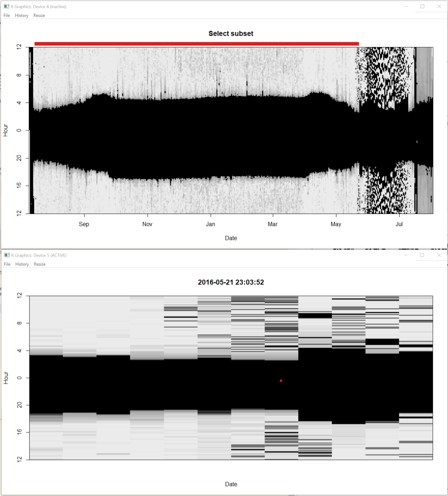

# Twilight Annotation {#twilight}

There are a few options for how to define / edit twilights. 

All tools discussed in this manual require as one of their inputs a dataframe containing the times of sunrise and sunset (henceforth twilights) for the duration of the study period. The twilight times are estimated based on a light-level threshold, which is the light value that seperates day from night - values above the threshold indicate the sun has risen and values below the threshold value indicate the sun has set. There are a few options for how to generate the twilight data. `twilightCalc` is one function that allows transitions to be defined and is part of the `GeoLight` package. Given the much better realisation of this process in TwGeos, we will not discuss the _GeoLight_ version of defining twilights. _twGeos_ provides an easier to use and more interactive process that is called `preprocessLight`. An important input, besides the raw data, is a pre-defined light intensity threshold value.


> How do I know which thresold to use? 
>
> You should choose the lowest value that is consistently above any noise in the nighttime light levels. For many .lig data sets 2.5 is above any nighttime noise. For forest interior, ground dwelling species a lower threshold may be helpful - especially if there isn't much 'noise' during the night. A threshold of 1 may be appropriate for such species. 


It is a good idea to plot (parts) of the dataset and see how the threshold fits into the light recordings:


```{r, fig.height=4, fig.width=10}
threshold <- 2.5

par(mfrow = c(1, 1), mar = c(2, 2, 2, 2) )
with(raw[2000:5000,], plot(Date, Light, type = "o", pch = 16, cex = 0.5))
abline(h=threshold, col="orange", lty = 2, lwd = 2)
```

Another useful plot can be created using `lightImage`; In the resulting figure, each day is represented by a thin horizontal line that plots the light values as grayscale pixels (dark = low light and white = maximum light) in order from bottom to top. a light image allows you to visualize an entire data set at once, and easily spot discrepancies in light to dark transitions. 
Additionally, you can add the sunrise and sunset times of the deployment or retrieval locaitons (using `addTwilightLine`). This may help to spot inconsistncies in the dataset, e.g.:
* time shifts - resulting in a good overlap of twilight times at the beginning but a systematic shift between expected and recorded twilight times.
* false time zone - if the predicted sunrise and sunset times are shifted up- or downwards it is highly likely that your raw data is not recorded (or has been transformed) in GMT (or UTC). Check with producer or data provider.
Furthermore, the lines can help to identify the approximate timing of departure and arrival to the known deployment or retrieval site and this may help to identify calibration periods that are requirred in the next steps of the analysis.


```{r, fig.height=4, fig.width=10, warning=FALSE, message=FALSE}
offset <- 12 # adjusts the y-axis to put night (dark shades) in the middle

lightImage( tagdata = raw, # light data
offset = offset,     
zlim = c(0, 20)) # y axis

addTwilightLine(lon = lon.calib, lat = lat.calib, zenith = 96)
``` 


In the next step, we want to define daily sunrise and sunset times. `preprocessLight` is an interactive function for editing light data and deriving these twilight times Note: if you are working on a Mac you must install Quartz first (https://www.xquartz.org) and then set gr.Device to “x11” in the function. If you are working with a virtual machine, the function may not work at all. Detailed instructions of how to complete the interactive process can be found by running the following code:


```{r, eval=FALSE}
?preprocessLight
```

Below, we explain the major functionalities.

When you run,

```{r, eval=FALSE}
twl <- preprocessLight(raw, 
threshold = threshold,
offset = offset, 
lmax = 20, # max. light value (adjust if contrast between night and day is weak)
gr.Device = "x11") # x11 works on a mac (if Quarz has been installed and works on most Windows machines too)
```

two windows will appear. Move them so they are not on top of each other and you can see both. They should look like a big black blob (Kiran`s expression). This identifies the “nightime” period over time. The top of the blob shows all the sunrises and the bottom of blob shows all the sunsets. You can note for instance that the days get longer at the beggining of the time series, because the blob gets wider.

Step 1. Click on the window entitled “select subset” with the left mouse button to choose start and right mouse button to choose end. You will notice that the red bar at the top moves and that the second window zooms into that time period. Select when you want your time series to start and end. This allows you to ignore for instance periods of nesting. Once you are happy with the start and end of the timeseries press “a” on the keyboard to accept and move to next step.



Step 2. click on the window entitled “Find twilights” and the second window will zoom in. All you need to do here is click in the dark part of the image and this will identify all the sunrises (orange) and sunsets (blue) based on the threshold defined in the presvious section. Press “a” on the keyboard to accept and move to next step.


Step 3. This step is for adding or deleting points.You can often skip it by pressing “a” on the keyboard. However, if you do want to add a point, you can click on the “Insert twilights” window to zoom in and then left click on the other window with the left mouse button to add a sunrise, and the right button to add a sunset some. You can use “u” on the keyboard to undo any changes, and “d” to delete any points which are extra. Press “a” to move to next step.

Step 4. This allows you to find points which have been miss-classified (often because the bird was in the shade or in a burrow) and to move the respective sunrise. Choose a point by clicking on it in the “edit twilights” window and the other window will displaz the sunrise (or sunsets) from the presvious and next days (purple and green) relative to the current sunrise or sunset. Thus if it is very much out, you can estimate the sunset on that day would likely have been sometime between that of the day before and after. You can then left click at the point where you want the day to start and press “a” to accept and move the sunrise or sunset. You will notice the red line then moves. Do this for as many points as necessary.


Then close the windows with "q".

> <span style="color:darkred">**IMPORTANT**</span>

> <span style="color:darkred">Save the output file so that you never have to do this step again. Best to save as a .csv file that can then easily be read into R at a later time.</span>

The output contains the following importnatn information:

* <span style="color:darkred">**Twilight**</span>
+ The date and time of the sunrise/sunset events
* <span style="color:darkred">**Rise**</span>
+ whether the Twilight is a sunrise (TRUE) or a sunset (FALSE)
* <span style="color:darkred">**Deleted**</span>
+ whether you marked this twilight with a "d", that means it is still in the file and can/should be exlcuded later on.
* Marker (see detailed description in `?preprocessLight`)
* Inserted (whether this Twilight was manually inserted)
* Twilight3 (the original Twilight. Only different to Twilight if you edited the timing)

Other processes like `twilightCalc` or the software `TAGS`produce different outputs but it is preferred to get them into this format (at least with the columns `Twilight`and `Rise`), since you can go ahead with any analysis you want using these two columns (***note: do not save these two columns only, since the other inforamtion is important to reproduce your analysis***).

To save this file we use the metadata variables that were defined above:

```{r, eval = FALSE}
write.csv(twl, paste0(wd, "/Results/", Species, "/", ID, "_twl.csv"), row.names = F)
```

This can later be loaded using the following code (note, that you have to define the class type `POSIXC` for the date):

```{r}
twl <- read.csv(paste0(wd, "/Results/", Species, "/", ID, "_twl.csv"))
twl$Twilight <- as.POSIXct(twl$Twilight, tz = "GMT") # get the Twilight times back into the POSIX. class format
```

The result of this first part that is **independent** of which package/analysis will be used next is the twiligth file that shoudl at least look like (can have more columns):

```{r}
head(twl[,c(1,2)])
```